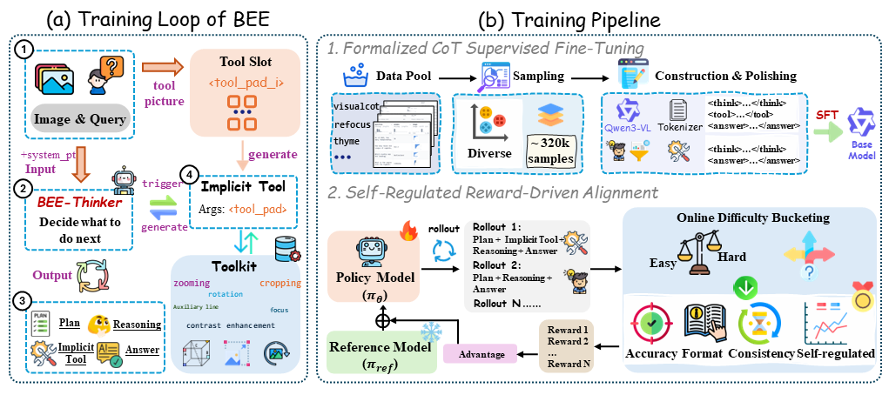
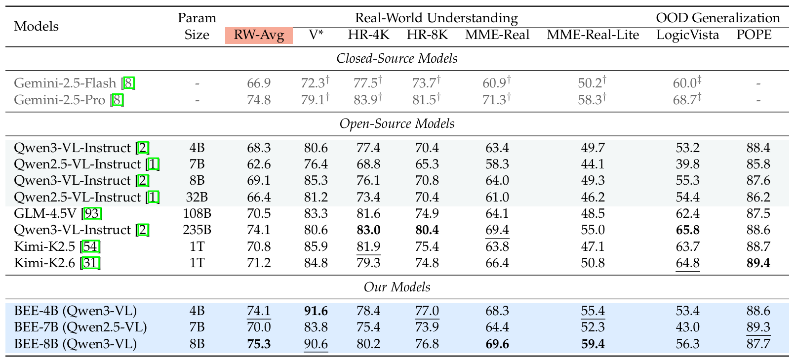

<p align="center">
  <h1 align="center">Beyond the Eye: Efficient Multimodal Reasoning
via Self-Regulated Implicit Visual Tools</h1>
  <p align="center">
  </p>
  <p align="center">
    <a href="https://self-improvement-tool.github.io/bee.github.io/">Xiuwei Chen</a>,
    <a href="https://self-improvement-tool.github.io/bee.github.io/">Quanlin Chen</a>,
    <a href="https://self-improvement-tool.github.io/bee.github.io/">Wentao Hu</a>,
    <a href="https://self-improvement-tool.github.io/bee.github.io/">Zisheng Chen</a>,
    <a href="https://self-improvement-tool.github.io/bee.github.io/">Kun Xiang</a>,
    <a href="https://self-improvement-tool.github.io/bee.github.io/">Zehua Ma</a>,
    <a href="https://self-improvement-tool.github.io/bee.github.io/">Mingyang Zhang</a>,<br>
    <a href="https://self-improvement-tool.github.io/bee.github.io/"> Jianhua Han</a>,
    <a href="https://self-improvement-tool.github.io/bee.github.io/"> Hanhui Li</a>,
    <a href="https://self-improvement-tool.github.io/bee.github.io/"> Hang Xu</a>,
    <a href="https://self-improvement-tool.github.io/bee.github.io/"> Xiaodan Liang</a>
  </p>
  <p align="center">
    <a href="https://arxiv.org/abs/2607.11106">
      
    </a>
    <a href="https://self-improvement-tool.github.io/bee.github.io/" target="_blank">
    
    </a>

  </p>
</p>

<p align="center">
    
</p>
We introduce <b>BEE</b>, a self-regulated training paradigm that enables multimodal large language models (MLLMs) to adaptively invoke implicit visual tools only when internal knowledge is insufficient, significantly reducing redundant tool usage and inference latency.
<br>

## 🔥Updates
* **2026.09.04** Code release in progress (currently uploading).

## 🔍Overview
<details open="open" style='padding: 10px; border-radius:5px 30px 30px 5px; border-style: solid; border-width: 1px;'>
  <summary>Tabel of Contents</summary>
  <ol>
    <li>
      <a href="#installation">Installation</a>
    </li>
    <li>
      <a href="#sft-training">SFT Training</a>
    </li>
    <li>
      <a href="#rl-training">RL Training</a>
    </li>
    <li>
      <a href="#inference">Inference</a>
    </li>
    <li>
      <a href="#citation">Citation</a>
    </li>
    <li>
      <a href="#acknowledgement">Acknowledgement</a>
    </li>
  </ol>
</details>

## ⚙Installation

```bash
git clone https://github.com/chen-xw/BEE-Official-Code.git
```

Note: Automatically adjust to the appropriate version based on the GPU and CUDA version

SFT environment:
```bash
conda create -n bee_sft python=3.10
conda activate bee_sft
cd LlamaFactory-main
pip install -r requirements.txt
```

RL environment:
```bash
cd EasyR1-main
conda create -n bee_rl python=3.11
conda activate bee_rl
pip install -r requirements.txt
```


<p align="center">
    
</p>

## 🔧SFT Training
### Training Scripts
See [this folder](./LlamaFactory-main/example.sh).

### Implementation Details
The supported models include Qwen2.5-VL-7B and Qwen3-VL-4B/8B. Please download the Instruct versions from the official repository.


## 🚀RL Training
We implement our RL training based on [EasyR1](https://github.com/hiyouga/EasyR1).

### Training Scripts
See this [training script](./EasyR1-main/example.sh).

After training, remember to use [model merging script](./RL/examples/merge_model.sh) to merge the parameter splits and get the final model.


### Evaluation
We evalutate BEE on [VLMEvalKit](https://github.com/open-compass/VLMEvalKit).


⚠**Note that:**

To accurately reproduce the result:
* Please use the following user prompt for VLMEvalKit evaluation:
 `Analyze the image within <think> tags; if details are unclear, output enhancement visual tokens in <START_OF_GEN> and <END_OF_GEN>; if the image is sufficient, output the final answer in <answer> tags.` 
* Please apply an API model as a supplementary judge.

## 🖊Citation
If you find this work useful, please use the following BibTeX. Thank you for your support!

```bibtex
@article{chen2026bee,
      title={Beyond the Eye: Efficient Multimodal Reasoning via Self-Regulated Implicit Visual Tools}, 
      author={Xiuwei Chen, Quanlin Chen, Wentao Hu, Zisheng Chen, Kun Xiang, Zehua Ma, Mingyang Zhang, Jianhua Han, Hanhui Li, Hang Xu, Xiaodan Liang},
      year={2026},
      journal={arXiv preprint arXiv:2607.11106}
}
```

## 🙏Acknowledgement
We sincerely thank the following great works as they provide valuable data or code for our work:
* [Zebra-CoT](https://huggingface.co/datasets/multimodal-reasoning-lab/Zebra-CoT)
* [Visual-CoT](https://huggingface.co/datasets/deepcs233/Visual-CoT)
* [ReFoCus](https://arxiv.org/abs/2501.05452)
* [EasyR1](https://github.com/hiyouga/EasyR1)
* [VLMEvalKit](https://github.com/open-compass/VLMEvalKit)
* [LLaMa-Factory](https://github.com/hiyouga/LLaMAFactory)

